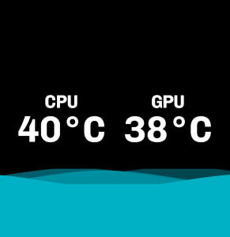

# This NZXT integration
Something I made for myself but you are welcome to use it.

This integration shows CPU and GPU temperature with RAM usage as the little sea.
The sea level changes based on the percentage of used RAM.

When provided with Spotify API credentials it will try to get your current playing song every 10 seconds.

It will show the current moment in song and the cover art as the background.

The integration also has some other options you can look through.

# Use in Kraken web integration
URL: https://www.pouekdev.one/nzxt-integration/

# Preview

Made with React, Vite, Tailwind and JavaScript.